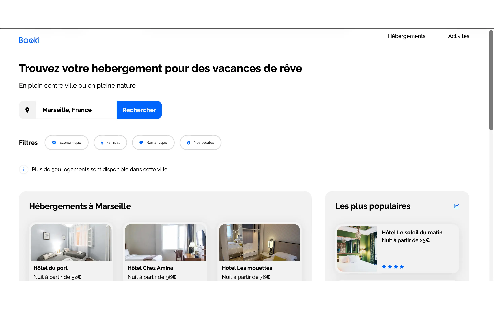

# Booki

- Ce travail a été réalisé dans le cadre du projet n°3 de la formation Intégrateur Web d’OpenClassrooms.

- Booki est une entreprise qui propose de trouver un hébergement pour des vacances de rêve.
- L'objectif du site est de permettre aux utilisateurs de :
	- • rechercher des hébergements dans la ville de leur choix (par exemple, Marseille),
	- • filtrer les résultats de recherche selon leurs besoins (Économique, Familial, Romantique, Nos pépites),
	- • découvrir des activités touristiques populaires dans la région.

## Outils et langages pour la réalisation du projet

- Le projet a été réalisé en **HTML5** et **CSS3**.
